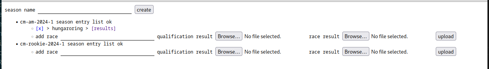

# sgpHelper

Anaylze your simracing.gp racing season.

## todo

- make default values configurable (filename/directories ...)
- manipulate entry list
- better error messages in case of unknown team/driver
- result points
- calculate season results
- and many more ...